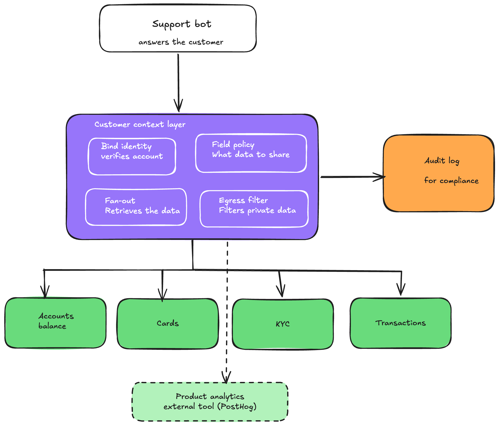
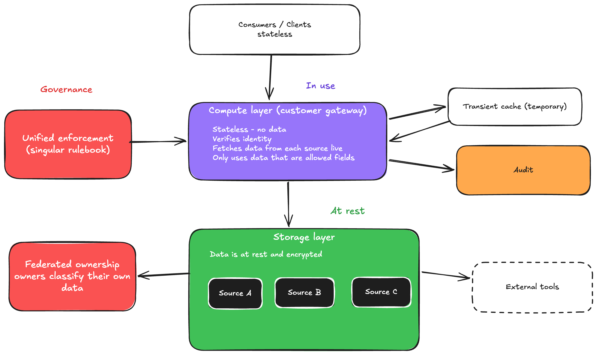

# Part 2: A scalable, governed data layer

## Approach
Put one read-only gateway between the bot and the services that own the data. Through this way, the bot is no longer allowed to reach the services itself, so everything goes through this one door. The gateway doesn't store any data of its own. It checks who's asking, fetches from the real owners, removes anything private, and records the access. Additionally, this also allows complete observability and governance with ease as its just a singular gateway.

## Positions

**1. Who owns what, and how it's exposed**
- Each service owns its own slice i.e Accounts has balance, Cards has card status, KYC has identity, Payments has transactions.
- Each service exposes a read API, and every field is tagged `safe`, `internal`, or `restricted` by the team that owns it.
- Ownership stays with those teams because they know best which of their fields are sensitive. The gateway just enforces what they declared.
- The analytics tool is external (a third-party product like PostHog), so it only ever sees a fake stand-in ID and the customer's actions, never their real identity or money. Any signals we read back from it are treated as just another tagged field.

**2. Always the ensures its the right customer and the safe and correct fields**
- The bot never picks whose data to load. The customer's identity comes from their signed login, and the gateway reads it from there, so the bot can't ask for someone else's account.
- Every record that comes back is double-checked to make sure it really belongs to that customer.
- The gateway only pulls the fields marked `safe`. The private ones (CNIC, full card number, IBAN) are never pulled in at all.

**3. When a service is slow or down**
- The gateway asks every service at the same time, each with a short time limit, and stops waiting on any one that's failing.
- Each answer is marked `fresh`, `stale`, or `unavailable`, so the bot replies with what it has and is honest about what it can't see.
- It never guesses a number. "I can't see that right now" is better than a wrong answer.
- The gateway only reads data, so even if a service goes down, nothing gets broken or changed.

**4. Keeping data in the right country**
- By law, a customer's financial data has to stay in their own country, and if the product runs in several countries, so each country gets its own protected zone.
- A customer's request is handled fully inside their own country. Their data never crosses a border just to build an answer.
- The only thing that ever leaves the country is the fake stand-in ID sent to analytics, which keeps both privacy and the law satisfied.

**5. Adding new data later**
- A team adds the new field to its own service and tags it. Nothing else breaks, because it's just an addition.
- The gateway blocks anything not clearly allowed, so the new field stays hidden until someone turns it on on purpose.
- If a new field is added it can never leak just by being added. The default is always "not shared."

**6. Growing to more services and more AI tools**
- Adding a new service is just plugging in another source. For this no new code would be needed.
- Adding a new AI tool (a collections bot, fraud checks, an in-app helper) is just another caller with its own list of what it's allowed to see.
- The gateway holds no data, so to handle more traffic you just run more copies of it. This ensures complete statelessness.

The second diagram shows the same design another way: the working part is kept separate from the storage part, data is protected whether it's moving, in use, or stored, and each team owns its data while the rules are enforced in one place.

## Trade-offs
- I put everything behind one gateway instead of letting the bot reach services directly, which gives one safe checked door but means everything now depends on that gateway, so I would rethink it if it ever got too hard to keep reliable.
- I fetch data live through the gateway instead of reading old logs, which makes answers correct and governed but a little slower, so I'd rethink it if it got too slow and caching couldn't make up for it.
- I added a short-lived cache for speed, which lightens the load but means a value can be slightly out of date, so I skip the cache for fast-changing data like the balance.
- In the case of multiple countries, I would run a separate gateway in each country to keep that country's data at home, which costs more and makes it harder to combine data across countries, so I would only drop this in a country with no residency rule.

## Left out on purpose
- Read-only: the bot can't change anything (no freezing a card). Actions need a stronger auth story, which is a separate job.
- Time-based cache, not instant-refresh, started simple for now.
- Fuller governance tooling (data catalogue, retention rules, named stewards)